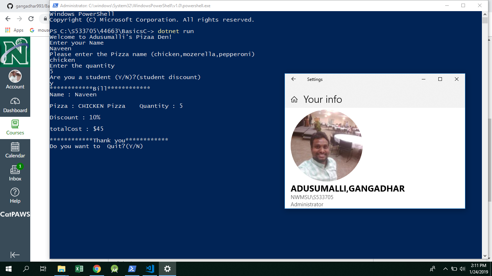

# BasicsC-
## My application name is Adusumalli's Pizzas den. It helps the customers to order their favourite pizzza along with number of pizzas they want. Students can get 10 percent discount in my application simply by entering Yes when the applications prompts the user. After the order is finished an automatic bill is generated with the complete details of the order.

## Enter the name,Enter the pizza you want, enter the number of pizzas you want, and answer yes/no if you are student.

